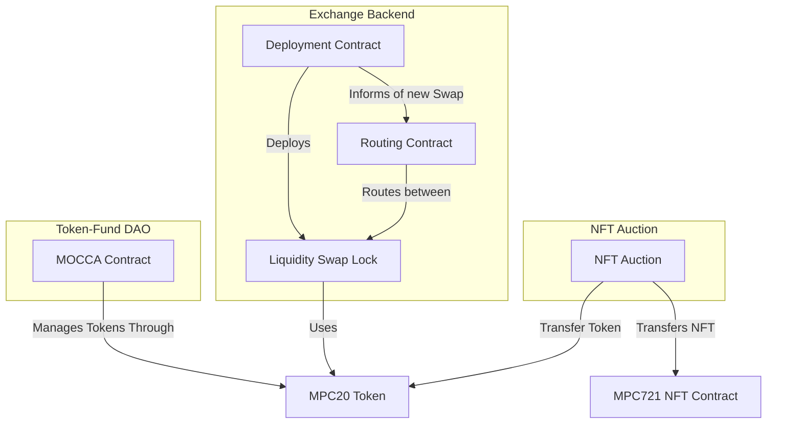

<div align="center">


# DeFi: Smart Contracts for Decentralized Finance

[Official Repository](https://gitlab.com/partisiablockchain/language/contracts/defi)
| [Rustdoc](https://partisiablockchain.gitlab.io/language/contracts/defi/defi_common/index.html)
| [PBC Documentation](https://partisiablockchain.gitlab.io/documentation/)

</div>

The Partisia Blockchain Foundation provides the following reviewed smart contracts,
as examples of decentralized finance problems with a blockchain solution.

The Defi smart contracts repo is created as a collection of complex examples with a mature code base. If you are new to
writing smart contracts on Partisia
Blockchain we recommend you to
visit [our documentation](https://partisiablockchain.gitlab.io/documentation/smart-contracts/introduction-to-smart-contracts.html)
and [the example contracts](https://gitlab.com/partisiablockchain/language/example-contracts).

## Contracts Overview

Contracts:

- [`token-v2`](./rust/token-v2): [MPC-20](https://partisiablockchain.gitlab.io/documentation/smart-contracts/integration/mpc-20-token-contract.html) Token Contract. Basic contract used by most of the below contracts.
- [`nft-v2`](./rust/nft-v2): [MPC-721](https://partisiablockchain.gitlab.io/documentation/smart-contracts/integration/mpc-721-nft-contract.html) NFT Contract. Basic contract used by most of the below contracts.
- [`liquidity-swap`](./rust/liquidity-swap): Automated Market Maker Contract that allows users to exchange tokens, with an automatically selected exchange rate based on the available liquidity in the contract pools.
- [`liquidity-swap-lock`](./rust/liquidity-swap-lock): Automated Market Maker with support for short-termed Option contract-likes.
- [`zk-liquidity-swap`](./rust/zk-liquidity-swap): Automated Market Maker Contract with front-running
  protection, by using secret-sharing for inputs, preventing anyone from
  seeing the swap until it has been committed to.
- [`nft-auction`](./rust/nft-auction) Auction contract that allows deployer to sell an NFT. Both NFT and bids are escrowed.
- [`zk-deposit`](./rust/zk-deposit): Deposit smart contract that allows users to transfer token assets to other users using an alternative secret identity, without knowing the user's blockchain identity
- [`dex-swap-factory`](./rust/dex-swap-factory): Deployment contract for `liquidity-swap` contracts.
- [`conditional-escrow-transfer`](./rust/conditional-escrow-transfer): Contract to facilitate conditional transfer of funds. The contract acts as a trustee in a value transaction with predetermined conditions.
- [`liquid-staking`](./rust/liquid-staking): The Liquid Staking Contract allows token holdes to delegate the responsibility for staking to a third party (the staking responsible,) who has a responsibility to select good staking opportunities.
- [`mocca`](./rust/mocca): Decentralized Autonomous Organization capable of managing MPC-20 tokens through the use of conditional proposals.
- [`swap-router`](./rust/swap-router): Routing contract that utilizes the swap lock functionality of the [Liquidity Swap Lock Contract](../liquidity-swap-lock/README.md) to perform swaps between different [Tokens](../token/README.md), that might not have a direct swap contract between them.
- [`zk-order-matching`](./rust/zk-order-matching): Order matching contract using secret-sharing to hide orders until a match have been found.
- [`call-option`](./rust/call-option): Call option contract allowing a buyer and seller to agree to exchange tokens in the future at a specified price

Shared libraries:

- [`defi-common`](./rust/defi-common): Shared library for common functionality
  for defi contracts, including:
  * Math library for liquidity swapping.
  * Generalized permission system.
  * Data structures for tracking deposited token balances.
  * Shared logic for implementing tokens.

Deprecated Contracts:

- [`token`](./rust/token): Legacy [MPC-20](https://partisiablockchain.gitlab.io/documentation/smart-contracts/integration/mpc-20-token-contract.html) Token Contract.  Uses an inefficient storage system, which makes it expensive to use.
- [`nft`](./rust/nft): Legacy [MPC-721](https://partisiablockchain.gitlab.io/documentation/smart-contracts/integration/mpc-721-nft-contract.html) NFT Contract. Uses an inefficient storage system, which makes it expensive to use.

### Use-cases and Constellations

The contracts of this repository can be used for multiple use cases. The
commonality is their use of either [a token contact](./rust/token-v2), or [a NFT
contract](./rust/nft-v2). Many contracts serve a stand-alone use-case, while others
are mainly useful in archtypical constellation of smart contracts.



## Usage

All smart contracts can be compiled using the [Cargo Partisia Contract](https://gitlab.com/partisiablockchain/language/cargo-partisia-contract) tool from the `rust` directory:

```bash
cargo pbc build --release
```

The `--release` argument ensures that contracts are minimized. Resulting
contract `.pbc` files can be found in the `rust/target/wasm32-unknown-unknown/release` folder, and can be
 [directly deployed to Partisia Blockchain](https://partisiablockchain.gitlab.io/documentation/smart-contracts/compile-and-deploy-contracts.html).

Individual contracts can be compiled directly from the respective contract's
directory.

### Testing

The smart contract test suite is run by using the following script:

```bash
./run-java-tests.sh -bc
```

The `-b` argument ensure that contracts are rebuilt, while the `-c` argument
results in a coverage report, located at `contract-java-test/target/coverage`.
