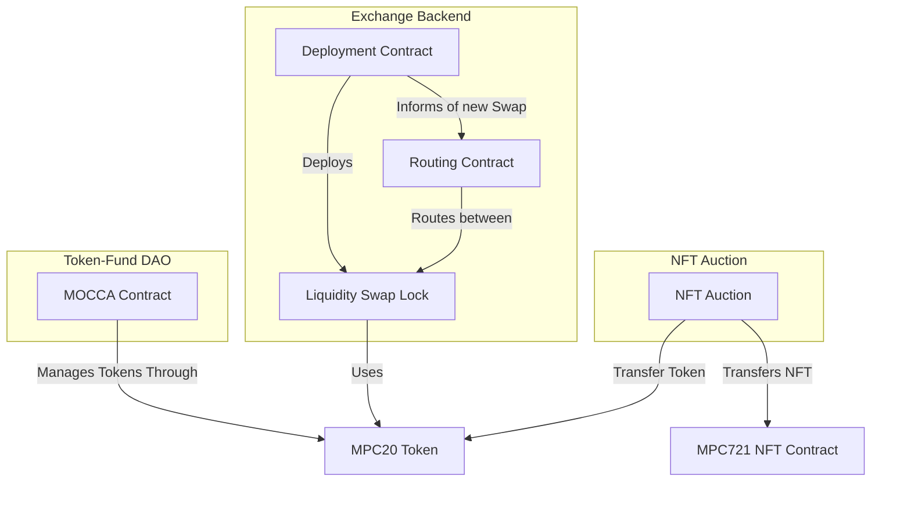

# DeFi: Smart Contracts for Decentralized Finance

The Partisia Blockchain Foundation provides the following reviewed smart contracts,
as examples of decentralized finance problems with a blockchain solution.

The Defi smart contracts repo is created as a collection of complex examples with a mature code base. If you are new to
writing smart contracts on Partisia
Blockchain we recommend you to
visit [our documentation](https://partisiablockchain.gitlab.io/documentation/smart-contracts/introduction-to-smart-contracts.html)
and [the example contracts](https://gitlab.com/partisiablockchain/language/example-contracts).

## Use-cases and Constellations

The contracts of this repository can be used for multiple use cases. The
commonality is their use of either [a token contact](./token-v2), or [a NFT
contract](./nft-v2). Many contracts serve a stand-alone use-case, while others
are mainly useful in archtypical constellation of smart contracts.



## Usage

To compile all the contracts using the partisia-contract tool run:

```bash
cargo partisia-contract build --release
```

To compile a single contract change directory to the specific contract and run the same command.
For example:

```bash
cd nft
cargo partisia-contract build --release
```

The compiled wasm/zkwa and abi files are located in

```bash
target/wasm32-unknown-unknown/release
```

To run the test suite, run the following command:

```bash
./run-java-tests.sh
```

To generate the code coverage report, run the following command:

```bash
cargo partisia-contract build --coverage
```

The coverage report will be located in `java-test/target/coverage`
