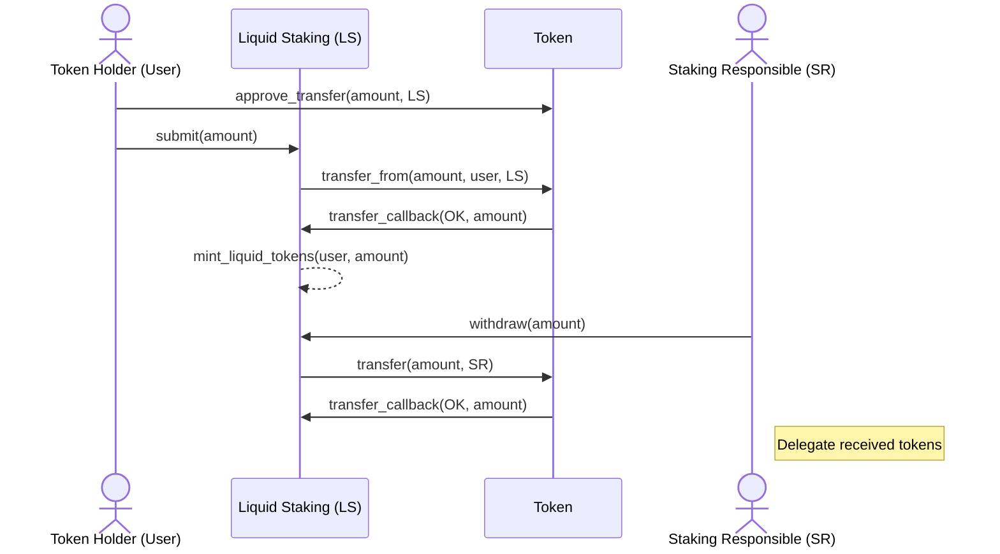
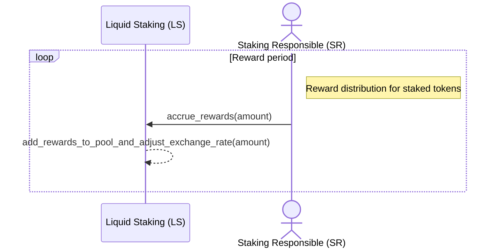
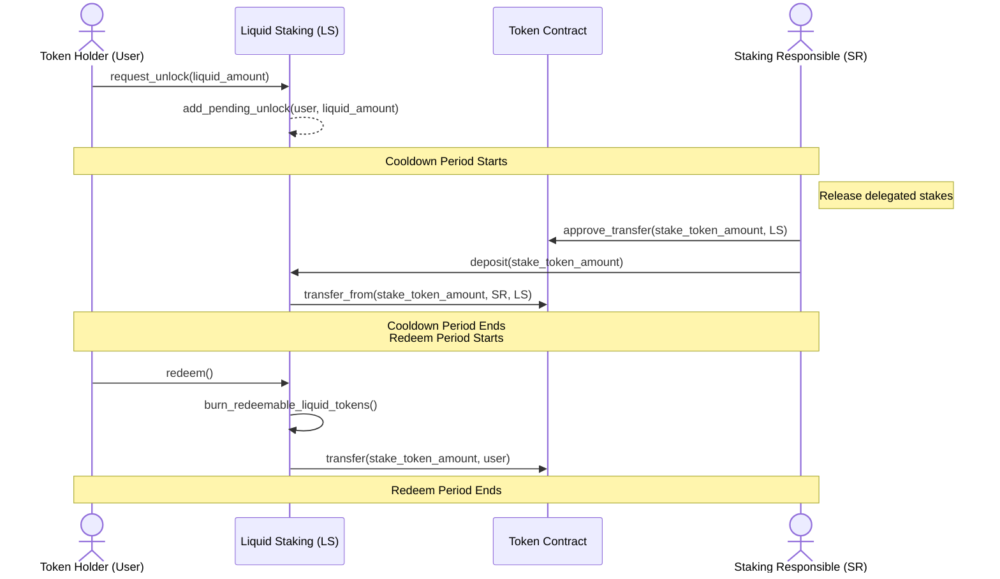
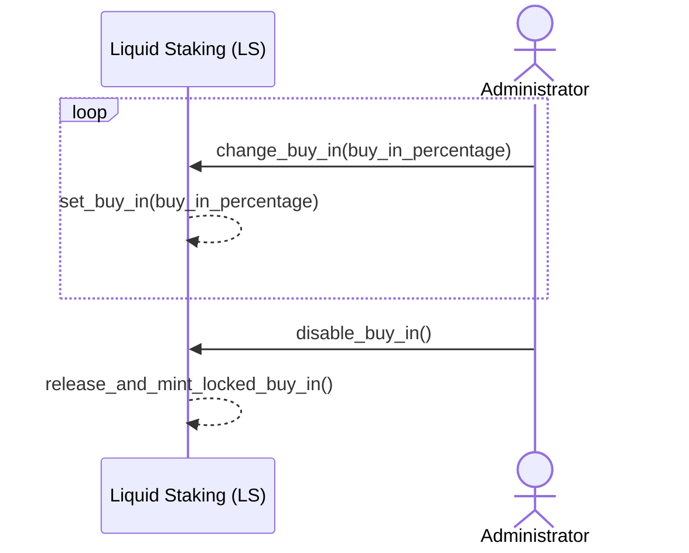

# Liquid Staking Contract

The Liquid Staking Contract allows token holdes to delegate the responsibility
for staking to a third party (the staking responsible,) who has
a responsibility to select good staking opportunities.

## Usage

Allows a token holder (also called user) to [`submit`] tokens (e.g. MPC MPC20 tokens) for liquid staking.
When the contract receives the submitted tokens, it mints liquid tokens based on the submitted amount and the current exchange rate.

The liquid token is a MPC20 token, which can be used like any other MPC20 token.

The contract specifies a staking responsible (a trusted account), who is the only account that is allowed to [`withdraw`] and [`deposit`] the underlying stake tokens from/to this contract.
The staking responsible monitors the contract and can withdraw the stake tokens when they are available on the contract.
This allows the staking responsible to delegate the tokens for staking.

When the staking responsible receives rewards for the staked tokens, it informs this contract about the reward by calling [`accrue_rewards`].
This allows the contract to adjust the exchange rate between the underlying stake token and the liquid token.

The token holder can [`request_unlock`] of an amount of his liquid tokens.
The contract calculates the amount of stake tokens that needs to be released from staking using the current exchange rate, and stores the information as a pending unlock.

When a pending unlock is registered, the staking responsible has a limited time period (called cooldown period) to release delegated stakes and [`deposit`] the required amount of the underlying token back into this contract.
After the cooldown period, the token holder has a limited time period (called redeem period) in which he can [`redeem`] his unlocked tokens.
If the token holder does not redeem the unlocked tokens within the redeem period, then the tokens go back into staking, and the token holder must send a new unlock request.

## Actors and Invocations
On this contract we operate with different actors: the contract owner, a token holder (also called user), the staking responsible, and the administrator.
These actors have access to distinct sets of invocations on the contract.

### Contract Owner
The contract owner deploys and initializes the contract.

### Token Holders
The token holder owns an amount of the underlying stake tokens, which he wants to submit for liquid staking.
The token holder has access to the following invocations on this contract:
* [`submit`]
* [`request_unlock`]
* [`redeem`]

### Staking Responsible
The staking responsible is the account that is responsible for delegating the tokens for staking.
The staking responsible has access to the following invocations on this contract:
* [`withdraw`]
* [`deposit`]
* [`accrue_rewards`]

### Administrator
The administrator is responsible for managing the buy in and cleaning up pending unlocks (i.e. remove expired pending unlocks).
The administrator has access to the following invocations on this contract:
* [`change_buy_in`]
* [`disable_buy_in`]
* [`clean_up_pending_unlocks`]

## Liquid Staking Flows
### Submit and Withdrawal
The following diagram illustrates the flow where a token holder submits an amount of the underlying stake token, the contract mints liquid tokens, and the staking responsible withdraws and delegates the tokens.

### Accrue Rewards
The following diagram illustrates the flow where the staking responsible receives rewards for staked tokens.
The staking responsible informs the contract about the accrued reward.

### Request Unlock, Deposit, and Redeem
The following diagram illustrates the flow where a token holder wants to unlock some liquid tokens in order to redeem the corresponding underlying stake tokens.

## Buy In
In order to invite token holders to submit their tokens as early as possible within a reward period,
the (registered) administrator of the contract can set a buy in fee.
During the reward period, the administrator can [`change_buy_in`] such that the buy in fee increases towards the end of the reward period.

When a token holder submits an amount of the underlying stake tokens to the contract, then a percentage of these tokens are locked until the administrator calls [`disable_buy_in`].

* Tokens in the buy in pool will first be minted when the buy in is disabled.
* Tokens in the buy in pool can be withdrawn and staked by the staking responsible.
* Tokens in the buy in pool are not included in the exchange rate calculation.
* Tokens in the buy in pool cannot be requested to be unlocked before the buy in is disabled.

